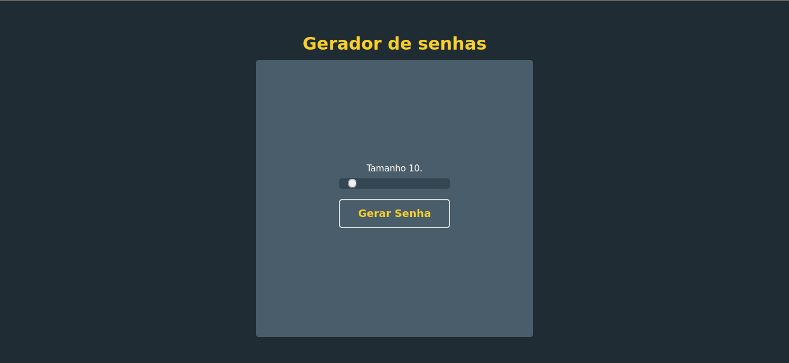

# Gerador de senhas

Projeto bem simples com objetivo de gerar senhas seguras
podendo variar entre 8 e 30 de tamanho para a senha

## Principais objetivos do projeto

- Apredizado
- Funcionalidades do javascript
- Controle de versionamento com git

## Exemplo

### HELP

Você pode trocar de branch para ver os comentarios
que foram feitos com objetivo de ajudar no entendimento.

## Continua nos proximos episódios :)
